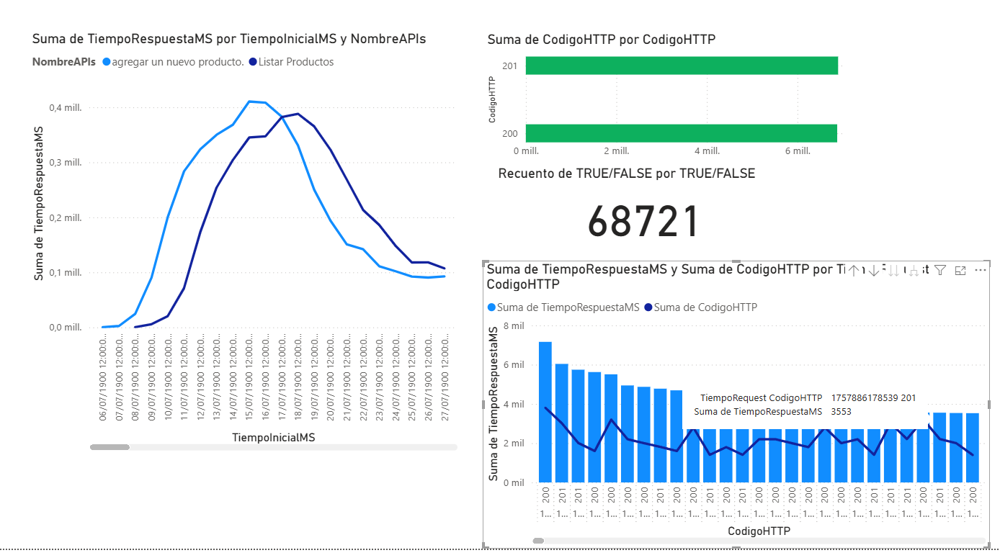
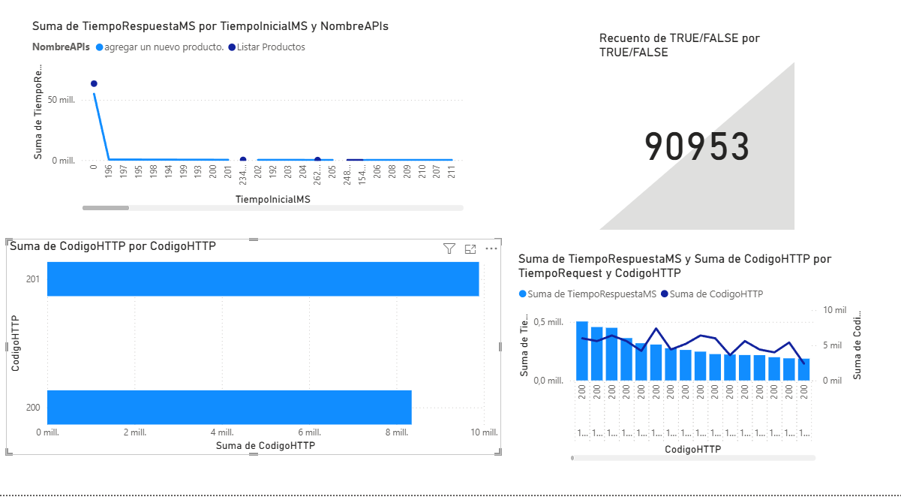

# 🚀 Prueba Técnica – Quality Control Engineer  

**Autor:** Hugo Manuel Ruiz Hernández  

Este repositorio contiene la solución a la prueba técnica enviada por **Double V Partners NYX**, organizada en dos partes:  
1. **API Testing** (Pruebas funcionales, carga, estrés y casos negativos sobre [FakeStore](https://fakestoreapi.com/docs))  
2. **Automatización Web (UI Automation)** sobre el sitio [Opencart Demo](https://opencart.abstracta.us)  

---

## 📂 Estructura del repositorio


---

## 🔹 Parte 1 – API Testing

### 📌 Funcionalidades cubiertas
- Listar productos por categoría **electronics**  
- Consultar un producto específico  
- Crear un nuevo producto  
- Actualizar la imagen del producto creado  
- Prueba de carga: **150 usuarios concurrentes durante 2 minutos**  
- Prueba de estrés: **Escalado de 100 a 1000 usuarios en intervalos de 150**  

### 📌 Casos Negativos
- Consultar producto inexistente (`/products/99999`)  
- Crear producto con body vacío  
- Actualizar producto con ID inválido  
- Crear producto con tipos de datos incorrectos (ej. `price: "texto"`)  

### 🛠 Herramientas utilizadas
- **Postman** → Pruebas funcionales y casos negativos  
- **JMeter** → Pruebas de carga y estrés  
- **Cypress + JavaScript** → Automatización UI
- **Power BI** → Análisis de resultados
- **GitHub** → Versionamiento y documentación
---

## ✅ Pruebas funcionales realizadas
1. Listar productos por categoría **electronics**  
2. Consultar datos de un producto específico  
3. Crear un nuevo producto  
4. Actualizar la imagen de un producto creado  

> Las evidencias se encuentran en `API_Testing/evidencias/`.  

---

## ⚡ Pruebas de rendimiento

### 1. Prueba de carga
- **Objetivo:** Validar el comportamiento del sistema con 150 usuarios concurrentes durante 2 minutos  
- **Script:** `LoadTest_150Users.jmx`  
- **Reporte:** `Performance_Testing/reports/report_150/index.html`  

### 2. Prueba de estrés
- **Objetivo:** Escalar el número de usuarios concurrentes de 100 a 1000 en intervalos de 150  
- **Script:** `Stress_Test_Results.jmx`  
- **Configuración Stepping Thread Group:**  
  - Usuarios iniciales: 100  
  - Incremento: 150 usuarios cada 30 segundos  
  - Ramp-up: 5 segundos  
  - Tiempo de retención: 120 segundos  

---

## ▶️ Cómo ejecutar las pruebas
1. Clonar este repositorio  
2. Importar la colección de Postman (`YourStore API.postman_collection.json`) y ejecutar las pruebas funcionales  
3. Abrir JMeter y cargar los scripts `.jmx` desde `Performance_Testing/jmeter_scripts/`  
4. Ejecutar las pruebas para generar los reportes  
5. Abrir `index.html` dentro de `Performance_Testing/reports/report_150/` para visualizar los resultados  
6. Guía de instalación y uso de JMeter: [Repositorio guía JMeter](https://github.com/HugoRuiz10/JMeter-Performance-Portfolio-Hugo.git)  

---

## 📊 Resultados
- Los reportes de las pruebas se encuentran en la carpeta `Performance_Testing/reports/` 
- El análisis adicional está disponible en `results/resultados_prueba.pbix`  


---


---

## ✅ Pruebas Automatizadas (UI – Cypress)

Las pruebas críticas de la tienda fueron automatizadas con **Cypress** usando **Page Object Model (POM)**:

### Funcionalidades cubiertas:
- Registro de usuario
- Inicio de sesión
- Restablecimiento de contraseña
- Navegación a *Laptops & Notebooks*
- Agregar un **MacBook Pro** al carrito
- Buscar y agregar una **Samsung Galaxy Tablet**
- Eliminar productos del carrito
- Aumentar cantidad de ítems
- Checkout hasta confirmación de la orden

### Ejecución
```bash
# Ejecutar en modo interactivo
npx cypress open

# Ejecutar en modo headless
npx cypress run --spec "cypress/e2e/shoppingFlow.cy.js"
